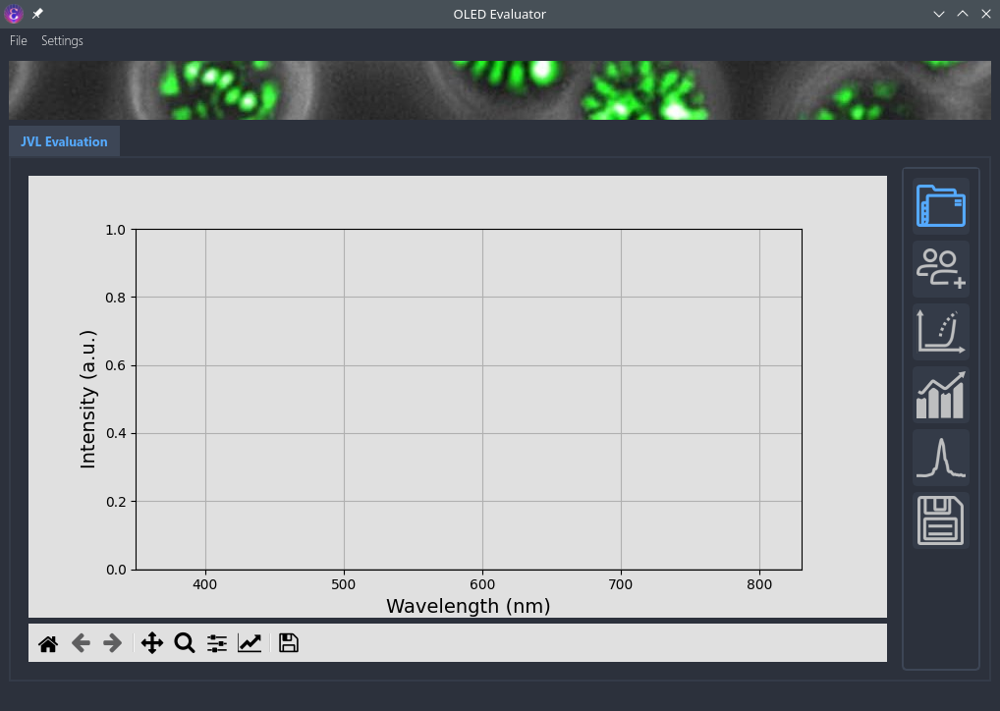
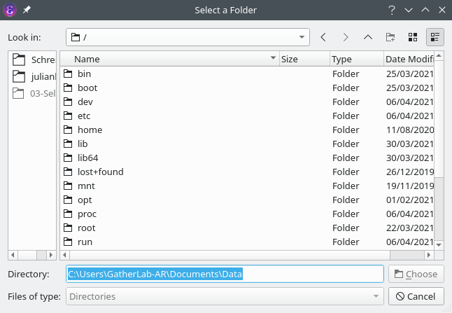
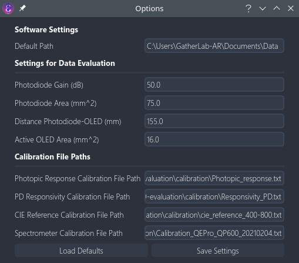
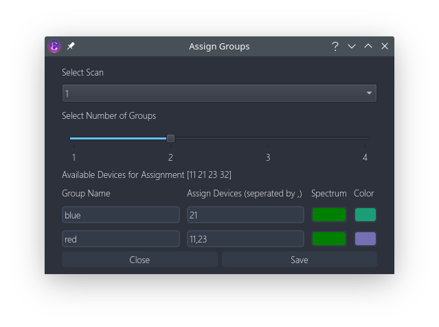
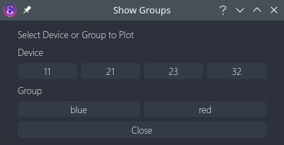
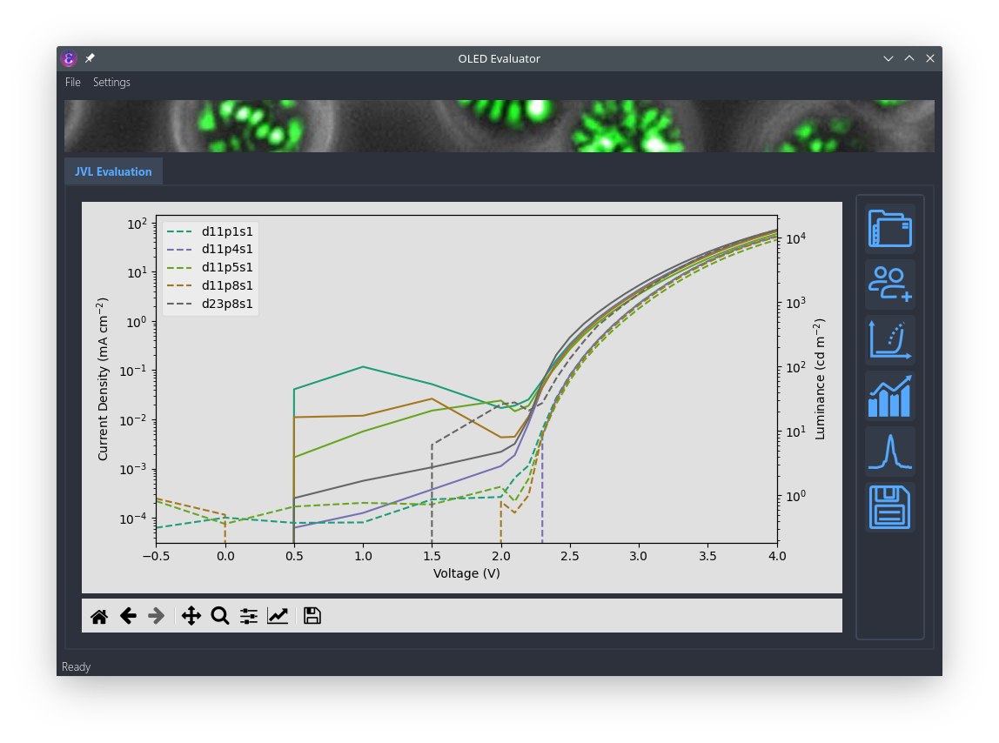
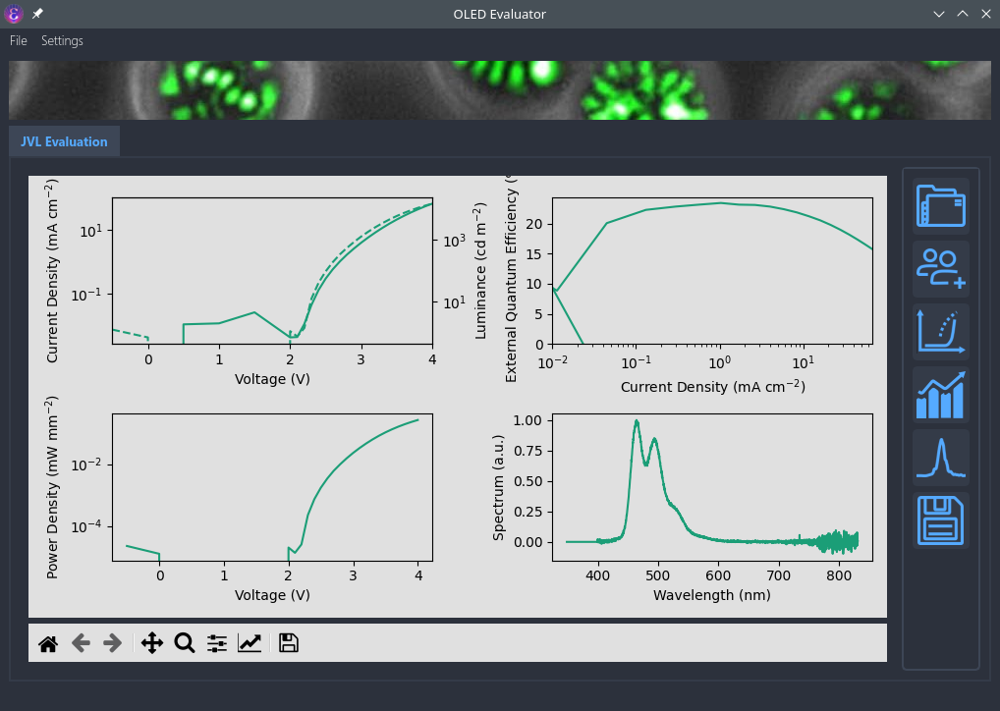
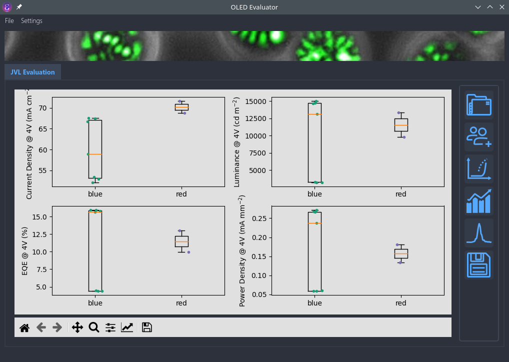
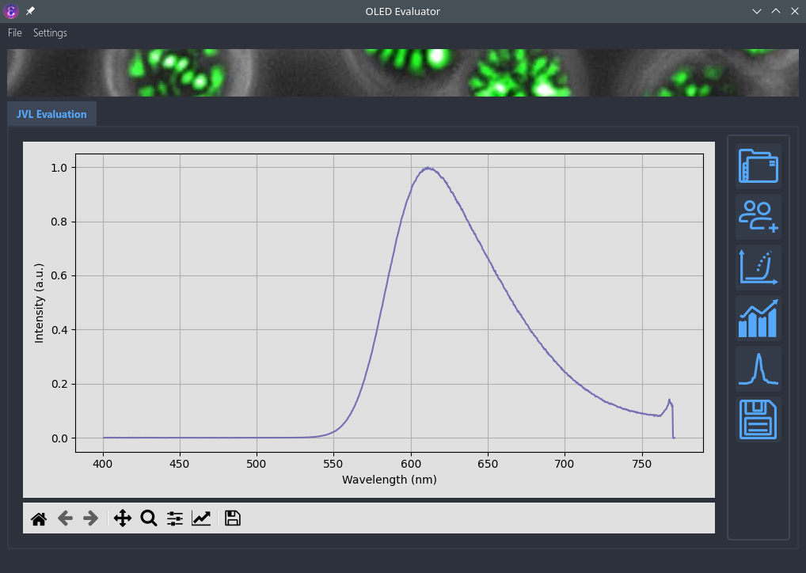

<h1 align="center">
  GatherLab OLED Evaluation Tool
</h1>

<p align="center">
   <a href="https://github.com/GatherLab/OLED-jvl-evaluation/commits/" title="Last Commit"></a>
   <a href="https://github.com/GatherLab/OLED-jvl-evaluation/issues" title="Open Issues"></a>
   <a href="./LICENSE" title="License"></a>
</p>

<p align="center">
  <a href="#setup">Setup</a> •
  <a href="#user journey">User Journey</a> •
  <a href="#development">development</a> •
  <a href="#licensing">Licensing</a>
</p>

Software for easy evaluation of previously measured data in the data format of https://github.com/GatherLab/OLED-jvl-measurement

## Setup

Setup a python environment with your favourite virtual environment management tool. The following step by step guide assumes that the user wants to use the since python 3.3 recommended software venv that ships with python on a windows machine.

1. Clone project folder to your local machine
2. Change e.g. with windows power shell into the project folder
3. Generate a virtual environement with the name "venv"

```terminal
py -m venv venv
```

4. Activate the new environement

```
Set-ExecutionPolicy Unrestricted -Scope Process
.\venv\Scripts\activate
```

5. Install required packages from requirements.txt (this assumes that pip is activated on your machine)

```
pip install -r requirements.txt
```

6. Execute the main.py file to start the program

```terminal
python3 main.py
```

## User Journey

The user journey for this software is quite pre-defined and follows a process
matched to our measured OLED data. All steps required to go through and
evaluate the JVL data are described in the following in detail.

### Setting a Directory

The user starts with the following situation. She can only select the folder
icon to set a directory and read in data. All other buttons on the right are disabled.



As a first step the user should select the directory where she stored all her
JVL files. This is done by pressing the first button on the right side with
the picture of a folder. A file dialog opens that lets the user select a
directory.



When the user presses "Ok" all file names from this folder that
end on \_jvl will be read in. The program now knows what data is available.

### Checking the Settings

If not done already, the user should now check the settings in the top
The user should now go to the top settings and check if all measurement
parameters that are entered here are correct.



The user has the following options:

- Default Saving Path: Change the default saving path to a folder where the files are usually read in from
- Photodiode Gain (dB): Enter photodiode gain that was used during the measurement (relevant parameters are then read out from photodiode_gain.json)
- Photodiode Area (mm^2): Enter photodiode area in mm^2
- Distance Photodiode-OLED (mm): Constant (autotube) or measured distance between photodiode and OLED
- Active OLED Area (mmm^2): Area of the active OLED pixel in mm^2
- Photopic Response Calibration File Path: Path to photopic response curve
- PD Responsivity Calibration File Path: Path to PD responsivity curve (depends on photodiode)
- CIE Reference Calibration File Path: Path to CIE calibration reference data
- Spectrometer Calibration File Path: Path to spectrometer (for certain fibre) calibration data

The user should then save the settings and can now continue with the evaluation

### Assigning Groups

In the second dialog the user can assign groups before the data is really
read in. The user has the option to select the scan number (only second scans
for instance) and by using the below slider the number of different groups
meaning OLED configurations. The available values of the slider are
restricted to the number of devices with their numbers listed below the
slider. The user must then give each group a name and assign the devices to
the groups with multiple devices separated with a comma (and no space).
Afterwards by pressing on the spectrum button of each group, the user must
assign a spectrum to each group only then she can continue with the
evaluation. Only files ending on \_spec of \_gon-spec can be selected as
spectrum. Lastly, the user has the option to assign a color to the group.
This is not obligatory since otherwise colors are preselected.



Now the actual reading in of the data happens and all the calculations take
place. This may take a few seconds.

### Looking at the Data

To obtain an overview of the different data the user can now select the _Show Groups_ dialog by clicking on the according button. Depending on the selected devices and the defined groups a variety of different buttons is presented to the user.



By pressing on one of them the user sees all JVL curves for the according device/group.



The user can now interact with the graph using the bottom toolbar to zoom,
change the scale etc. Furthermore, by clicking on the according line on the
legend the user can hide a certain graph that, for instance, doesn't show a
good performance or looks otherwise odd. Additionally, if all performance
data of a certain line is of interest the user can click on the mouse wheel
to be able to see the entire performance data of that pixel (including JVL,
EQE, Power density and spectrum).



The user should really go through all curves and unselect all pixels that
somehow look bad to efficiently use the next feature of the software.

### Looking at the Statistics

The user can now have a look at the statistics using the next dialog and selecting either to show the stats grouped by device or by group which results in the following graph



Like this one can get a fast overview over the most important performance parameters and some statistics that might immediatly (if a large enough control group) which device is better or worse (especially good for performance optimisation).

### Looking at the Spectra

Lastly the user may have a look at the spectra which is especially relevant for goniometer measurements. A dialog asks the user which group spectrum to plot.


The program automatically plots the spectrum angle resolved (if there is data) or the single spectrum which likewise results in one of the two graphs below.




### Saving Data

Finally, the user can save the evaluated data by pressing on the disk (last
icon). The files are automatically saved to a folder called "eval" within the
raw data containing folder. If the user wants to do any further evaluation
she can simply read that data in with every .csv capable program (e.g.
OriginLab). If the visualisation is not super important and the user is happy
with the graphs the program spits out, she can also save every graph by
pressing on the save button of the matplotlib toolbar below each graph.

## Development

### Formatter

- Python formatter: black

### Data Structures

In general data is organised in pandas dataframe in a relational database manner. One key defines the relationship of the dataframe to others. However, the relationship can be 1:n. The primary key is for all dataframes the index that shall allow to relate the dataframes among eachother and is marked with (PM) in the following.

- data_df: Contains the JVl data for all selected devices. The scan in the index should be the same for all of them since this is only after the user selected the relevant scan. Importantly, not all contained lists have the same length. The "masked" variable serves to check if a curve was masked by the user or not.

| index (PM) | device_number | voltage   | current   | current_density | pd_voltage | luminance | eqe      | luminous_efficacy | current_efficiency | power_density | masked |
| ---------- | ------------- | --------- | --------- | --------------- | ---------- | --------- | -------- | ----------------- | ------------------ | ------------- | ------ |
| d21p1s1    | 21            | [1,2,3, ] | [2,3,4, ] | [2,3,4, ]       | [5,6,7, ]  | [1, 2, ]  | [1, 2, ] | [1, 2, ]          | [1, 2, ]           | [1, 2, ]      | False  |
| d21p4s1    | 21            | [1,2,3, ] | [2,3,4, ] | [2,3,4, ]       | [5,6,7, ]  | [1, 2, ]  | [1, 2, ] | [1, 2, ]          | [1, 2, ]           | [1, 2, ]      | False  |
| d24p6s1    | 24            | [1,2,3, ] | [2,3,4, ] | [2,3,4, ]       | [5,6,7, ]  | [1, 2, ]  | [1, 2, ] | [1, 2, ]          | [1, 2, ]           | [1, 2, ]      | False  |

- spectrum_data_df: Contains all the spectrum data for the different groups

| index (PM) | wavelength     | background     | intensity      | calibrated_intensity | angle_resolved | correction_factor |
| ---------- | -------------- | -------------- | -------------- | -------------------- | -------------- | ----------------- |
| 21         | [1, 2, 3, ...] | [3, 4, 5, ...] | [6, 7, 8, ...] | [9, 10, 11, ...]     | True           | [0.1, 0.2]        |
| 24         | [1, 2, 3, ...] | [3, 4, 5, ...] | [6, 7, 8, ...] | [9, 10, 11, ...]     | False          | -                 |
| 31         | [1, 2, 3, ...] | [3, 4, 5, ...] | [6, 7, 8, ...] | [9, 10, 11, ...]     | False          | -                 |
| 34         | [1, 2, 3, ...] | [3, 4, 5, ...] | [6, 7, 8, ...] | [9, 10, 11, ...]     | False          | -                 |
| 41         | [1, 2, 3, ...] | [3, 4, 5, ...] | [6, 7, 8, ...] | [9, 10, 11, ...]     | False          | -                 |
| 44         | [1, 2, 3, ...] | [3, 4, 5, ...] | [6, 7, 8, ...] | [9, 10, 11, ...]     | False          | -                 |

- files_df: Contains the file names and all relevant information extracted from them for all files in the selected folder

| index (PM) | file_name                                          | device_number | pixel_number | scan_number |
| ---------- | -------------------------------------------------- | ------------- | ------------ | ----------- |
| d1p2s1     | "user/documents/data/2021-02-04_test_d1_p2.csv     | 1             | 2            | 1           |
| d1p2s2     | "user/documents/data/2021-02-04_test_d1_p2_02.csv  | 1             | 2            | 2           |
| d2p6s1     | "user/documents/data/2021-02-04_test_d2_p6.csv     | 2             | 6            | 1           |
| d11p5s5    | "user/documents/data/2021-02-04_test_d11_p5_05.csv | 5             | 5            | 5           |

- assigned_groups_df: Contains all information that was provided in the assigned groups dialog (except for the scan number)

| index (PM) | group_name | spectrum_path                                         | color   |
| ---------- | ---------- | ----------------------------------------------------- | ------- |
| 21         | Bphen      | "user/documents/data/2021-02-04_test_d21_p2_spec.csv" | #FFFFFF |
| 24         | Bphen      | "user/documents/data/2021-02-04_test_d21_p2_spec.csv" | #FFFFFF |
| 31         | Bphen:Cs   | "user/documents/data/2021-02-04_test_d31_p2_spec.csv" | #FFFFF0 |
| 34         | Bphen:Cs   | "user/documents/data/2021-02-04_test_d31_p2_spec.csv" | #FFFFF0 |
| 41         | Bphen:CsC  | "user/documents/data/2021-02-04_test_d41_p2_spec.csv" | #FFFFF1 |
| 44         | Bphen:CsC  | "user/documents/data/2021-02-04_test_d41_p2_spec.csv" | #FFFFF1 |

- spectrum_data_df and assigned_groups_df have a 1:1 relationship and are only kept seperate for logical reasons but could in principle be merged in a single dataframe.

- files_df and data_df have the same primary key and can be directly related with eachother. However, the primary keys of data_df are a subset of files_df since only the data of selected files is read in by the program and not all present in the folder. Device, pixel and scan number can be easily found out for each row by comparing to the files_df dataframe (join the dataframes basically).
