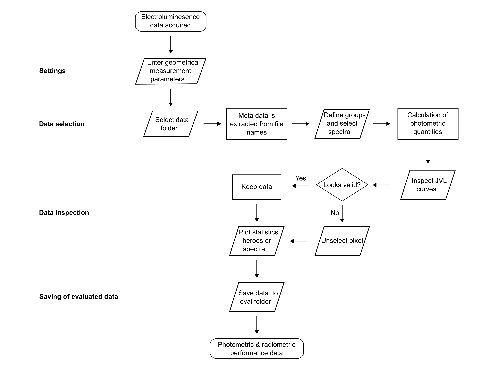
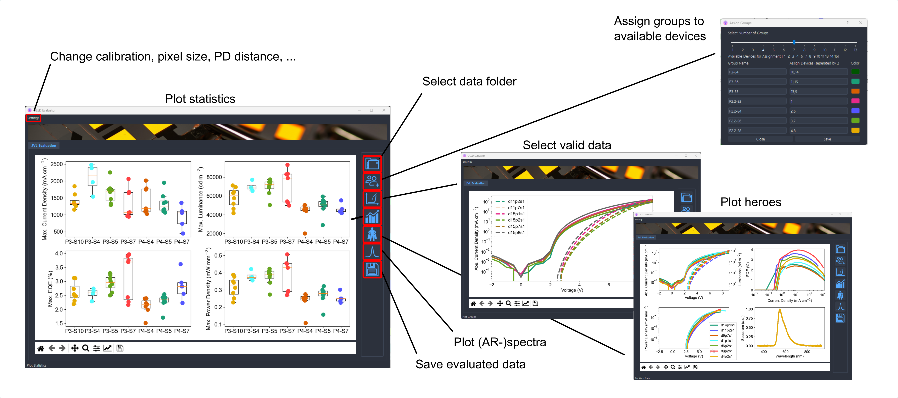

<h1 align="center">
  GatherLab OLED Evaluation Tool
</h1>

<p align="center">
   <a href="https://github.com/GatherLab/OLED-evaluation/commits" title="Last Commit"></a>
   <a href="https://github.com/GatherLab/OLED-evaluation/issues" title="Open Issues"></a>
   <a href="./LICENSE" title="License"></a>
</p>

<p align="center">
  <a href="#setup">Setup</a> •
  <a href="#user journey">User Journey</a> •
  <a href="#development">development</a>
</p>

Software for easy evaluation of previously taken data in the format of
https://github.com/GatherLab/OLED-jvl-measurement. It is essential that the raw
EL data (JV and photodiode voltage) are collected, as well as spectra for each
device configuration.

## Setup

Setup a python environment with your favourite virtual environment management tool. The following step by step guide assumes that the user wants to use the since python 3.3 recommended software venv that ships with python on a windows machine.

1. Clone project folder to your local machine
2. Change e.g. with windows power shell into the project folder
3. Generate a virtual environement with the name "venv"

```terminal
py -m venv venv
```

4. Activate the new environement

```
Set-ExecutionPolicy Unrestricted -Scope Process
.\venv\Scripts\activate
```

5. Install required packages from requirements.txt (this assumes that pip is activated on your machine)

```
pip install -r requirements.txt
```

6. Execute the main.py file to start the program

```terminal
python3 main.py
```

## User Journey

The user journey for this software is quite pre-defined and follows a process
matched to our taken OLED data. The process is described in the following flow
chart and illustrated in the screenshots below.




## Development

We recommend using our software packages to anyone who is adapting our AR-EL
characterization setup. We encourage anyone to report bugs and open pull
requests.

### Formatter

- Python formatter: black

### Data Structures

In general data is organized in _pandas_ data frames in a relational database
manner. One key defines the relationship of the data frame to others. However,
the relationship can be 1:n. The primary key is for all data frames the index
that shall allow to relate the data frames among each other and is marked with
(PM) in the following.

- **data_df**: Contains the JVL data for all selected devices. The scan in the index
  should be the same for all of them since this is only after the user selected
  the relevant scan. Importantly, not all contained lists have the same length.
  The “masked” variable serves to check if a curve was masked by the user or not.

| index (PM) | device_number | voltage   | current   | current_density | pd_voltage | luminance | eqe      | luminous_efficacy | current_efficiency | power_density | masked |
| ---------- | ------------- | --------- | --------- | --------------- | ---------- | --------- | -------- | ----------------- | ------------------ | ------------- | ------ |
| d21p1s1    | 21            | [1,2,3, ] | [2,3,4, ] | [2,3,4, ]       | [5,6,7, ]  | [1, 2, ]  | [1, 2, ] | [1, 2, ]          | [1, 2, ]           | [1, 2, ]      | False  |
| d21p4s1    | 21            | [1,2,3, ] | [2,3,4, ] | [2,3,4, ]       | [5,6,7, ]  | [1, 2, ]  | [1, 2, ] | [1, 2, ]          | [1, 2, ]           | [1, 2, ]      | False  |
| d24p6s1    | 24            | [1,2,3, ] | [2,3,4, ] | [2,3,4, ]       | [5,6,7, ]  | [1, 2, ]  | [1, 2, ] | [1, 2, ]          | [1, 2, ]           | [1, 2, ]      | False  |

- **spectrum_data_df**: Contains all the spectrum data for the different groups

| index (PM) | wavelength     | background     | intensity      | calibrated_intensity | angle_resolved | correction_factor |
| ---------- | -------------- | -------------- | -------------- | -------------------- | -------------- | ----------------- |
| 21         | [1, 2, 3, ...] | [3, 4, 5, ...] | [6, 7, 8, ...] | [9, 10, 11, ...]     | True           | [0.1, 0.2]        |
| 24         | [1, 2, 3, ...] | [3, 4, 5, ...] | [6, 7, 8, ...] | [9, 10, 11, ...]     | False          | -                 |
| 31         | [1, 2, 3, ...] | [3, 4, 5, ...] | [6, 7, 8, ...] | [9, 10, 11, ...]     | False          | -                 |
| 34         | [1, 2, 3, ...] | [3, 4, 5, ...] | [6, 7, 8, ...] | [9, 10, 11, ...]     | False          | -                 |
| 41         | [1, 2, 3, ...] | [3, 4, 5, ...] | [6, 7, 8, ...] | [9, 10, 11, ...]     | False          | -                 |
| 44         | [1, 2, 3, ...] | [3, 4, 5, ...] | [6, 7, 8, ...] | [9, 10, 11, ...]     | False          | -                 |

- **files_df**: Contains the file names and all relevant information extracted from
  them for all files in the selected folder

| index (PM) | file_name                                          | device_number | pixel_number | scan_number |
| ---------- | -------------------------------------------------- | ------------- | ------------ | ----------- |
| d1p2s1     | "user/documents/data/2021-02-04_test_d1_p2.csv     | 1             | 2            | 1           |
| d1p2s2     | "user/documents/data/2021-02-04_test_d1_p2_02.csv  | 1             | 2            | 2           |
| d2p6s1     | "user/documents/data/2021-02-04_test_d2_p6.csv     | 2             | 6            | 1           |
| d11p5s5    | "user/documents/data/2021-02-04_test_d11_p5_05.csv | 5             | 5            | 5           |

- **assigned_groups_df**: Contains all information that was provided in the assigned groups dialog (except for the scan number)

| index (PM) | group_name | spectrum_path                                         | color   |
| ---------- | ---------- | ----------------------------------------------------- | ------- |
| 21         | Bphen      | "user/documents/data/2021-02-04_test_d21_p2_spec.csv" | #FFFFFF |
| 24         | Bphen      | "user/documents/data/2021-02-04_test_d21_p2_spec.csv" | #FFFFFF |
| 31         | Bphen:Cs   | "user/documents/data/2021-02-04_test_d31_p2_spec.csv" | #FFFFF0 |
| 34         | Bphen:Cs   | "user/documents/data/2021-02-04_test_d31_p2_spec.csv" | #FFFFF0 |
| 41         | Bphen:CsC  | "user/documents/data/2021-02-04_test_d41_p2_spec.csv" | #FFFFF1 |
| 44         | Bphen:CsC  | "user/documents/data/2021-02-04_test_d41_p2_spec.csv" | #FFFFF1 |

- **spectrum_data_df** and assigned_groups_df have a 1:1 relationship and are only
  kept seperate for logical reasons but could in principle be merged in a single
  data frame.

- **files_df** and **data_df** have the same primary key and can be directly related
  with each other. However, the primary keys of data_df are a subset of files_df
  since only the data of selected files is read in by the program and not all
  present in the folder. Device, pixel, and scan number can be easily found out for
  each row by comparing to the files_df data frame (join the data frames basically).
